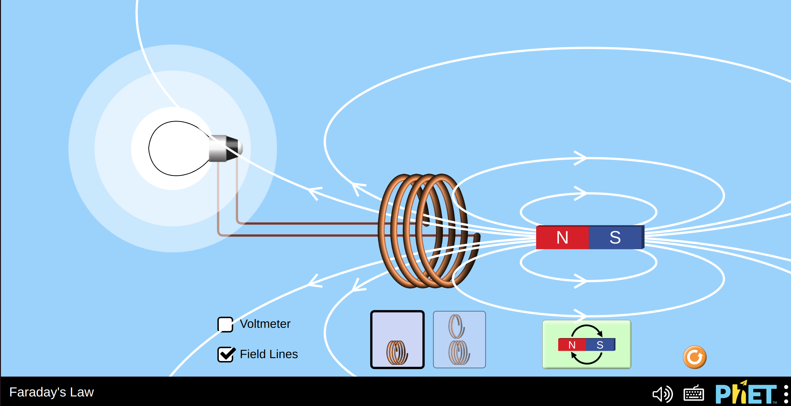
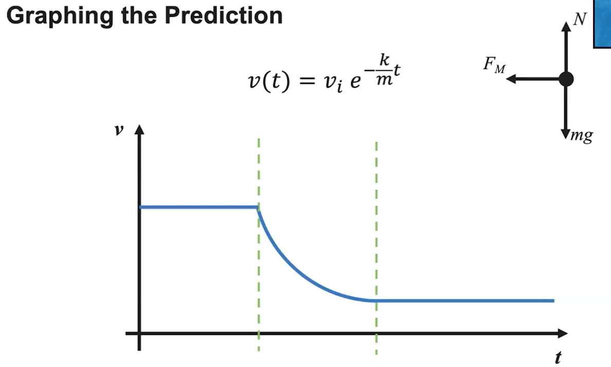
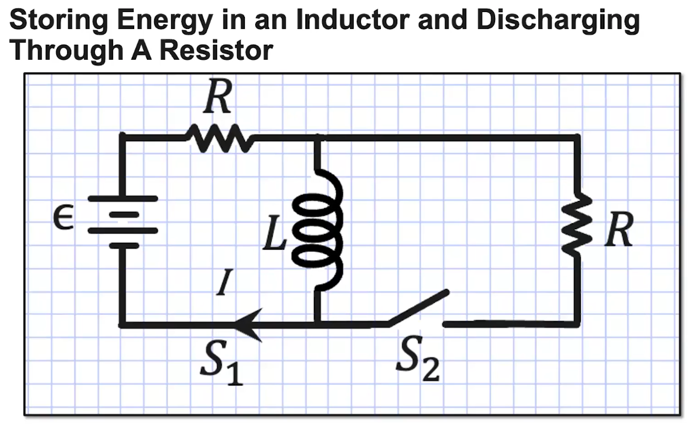

# Unit 13 Electromagnetic Inudction

## 13.1 Magnetic Flux 

### 13.1.1 expand the concept of flux to magnetic fields, discuss the vectors that come into play, and analyze a few conceptual questions. 

**FLUX**
- Flux is an amount of stuff going through an area 
- we've seen electric flux through a surface area: $\oint \vec{E} \cdot d\vec{A}$
- Now we have magnetic flux through a loop area: $\int \vec{B} \cdot d\vec{A}$
- the $d\vec{A}$ vector points `perpendicular` to the area of the loop.

### Takeaways: 
Magnetic flux depends on: 
- Strength of the Magnetic Field $|\vec{B}|$
- Size of loop area exposed to magnetic field  $\int dA$
- Angle of loop in relation to the field $\theta$

### 13.1.2 calculate the magnetic flux for several common situations, and learn when we need to integrate (and when we don't)

### Takeaways: 

When to integrate for flux: 

We only need to integrate if the magnetic field isn't constant over the entire area (it depends on r, or width, etc)

## 13.2 Electromagnetic induction 
### 13.2.1 break down the various components that make up Faraday's law and work through some examples. 

**Ohm's law**

$$ I = \frac{\Delta V}{R}$$

**Faraday's Law**

A changing magnetic flux induces an emf in the system

$$\text{emf} = -\frac{d\phi_B}{dt}$$

Faraday's law says If I have a magnetic flux going through a loop of wire, I can induce an emf in that loop of wire. And an emf ends up making a current and a field.

But faraday's law says that if you change that flux, the active change induced a current or an emf in the loop of wire, so I can actually make the light bulb light up. 

**Loop and Wire FRQ**

Calculate the magnitude of the induced emf generated around the loop at time t = 3.0s. 

$$\text{emf} = -\frac{d\phi_B}{dt}$$ 
$$\phi_B = \frac{\mu_0IL}{2\pi}ln(\frac{d+w}{d})$$

### Takeaways
- A changing magnetic flux induces an $emf = \Delta V = \epsilon$ in the system 
  - change the area (size or oreintation/angle)
  - change the field

### 13.2.2 introduce Lenz's law to determine the direction of induced current, using both the mathematical relationship and the "arrows and feathers" repsentation

**Faraday's Law**: a changing magnetic flux induces an emf in the system 

$$\text{emf} = -\frac{d\phi_B}{dt}$$

**Lenz's Law**: An induced emf generates a current that creates a magnetic field that opposes the change in flux

A conducting rod is sliding at a speed of 4.5m/s along conducting rails that are 0.75m apart. The rails are attached to a 5.0$\Omega$ resistor, completing a loop. The loop is in a $250mT$ magnetic field that is directed out of the page, as shown. 

The current generated in the resistor is

### 13.2.3 discuss the collection of Maxwell's equations and what they tell us about electric and magnetic fields. 

Maxwell's Equations: 

Maxwell's Equations are the set of equations that fully describe electromagnetism

**Maxwell's First Equation**

Gauss's Law 

$$\oint \vec{E} \cdot d\vec{A} = \frac{Q_{enc}}{\epsilon_0}$$

$$\vec{\nabla} \cdot \vec{E} = \frac{\rho}{\epsilon_0} $$

**Maxwell's Second Equation**

Gauss's Law for Magnetism 

$$\oint \vec{B} \cdot d\vec{A} = 0$$

$$\vec{\nabla} \cdot \vec{B} = 0$$

**Maxwell's Third Equation**: 

Faraday's Law 

$$\text{emf} = \oint \vec{E} \cdot \vec{dl} = - \frac{d\phi_B}{dt}$$

$$\vec{\nabla} \times \vec{E} = -\frac{\partial B}{\partial t}$$

**Maxwell's fourth equation**

Ampere's Law
$$\oint \vec{B} \cdot d\vec{l} = \mu_0I + \mu_0\epsilon_0\frac{d\phi_E}{dt}$$
$$\vec{\nabla} \times \vec{B} = \mu_0(\vec{J}+\epsilon_0\frac{\partial E}{\partial t}) $$

our integral of $B \cdot dl$ around a loop is $\mu_0I_{enc}$  
it's kind of like the magnetism version of Gauss's law

the Maxwell's addition says that you can have a magnetic field generated by an electric current. That's what Ampere's law is all about. 

A changing electric field in turn creates a magnetic field. 

## 13.3 Induced Currents and Magnetic forces. 

### 13.3.1 We will qualitatively investigate situations where an external magnetic field exerts a force on a conducting loop that is carrying an induced current. 

**Magnetic Forces on Charges**

A magnetic field exerts a force on charges moving through a field. 

$$\vec{F_M} = q\vec{v}\times \vec{B}$$

**Magnetic Forces on Current-Carrying Wires**

If the charges are inside a wire carrying a current that is inside a magnetic field, they will also experience a force from the magnetic field. 

The sum of these can be represented by a single magnetic force on that wire. 

$$\vec{F_M} = \int_0^L I(d\vec{l} \times \vec{B})$$

**Induced emf Produces an Induced Current**

By Faraday's Law, a changing magnetic flux induces an emf in a conducting loop. 

$$|\epsilon| = N|\frac{d\Phi}{dt}|$$

By lenz's law, the current will be in a direction that opposes the change in magnetic flux. 

**Changing Flux Caused by Translational Motion**

- Magnetic field is constant, but defined edges exist. 
- A conducting rectangular loop is pulled out of the field. 
- This causes a change in flux, inducing an emf, resulting in an induced current. 
- By focusing on just the sections of wire inside the field, we can use the right-hand rule to determine the direction of the magnetic force. 

**Changing Flux caused by Rotational Motion**

- Squre loop is rotated about an axis and entirely inside a constant magnetic field with angular speed $\omega$
- As the loop rotates, magnetic flux changes, inducing an emf that results in an induced current. 
- As the area of the loop rotates and magnetic flux increases through the loop, an induced current results from the indcued emf. 
- By applying the right hand rule, a magnetic force exists on all four sides. 
- By symmtery, the forces on the top and bottom cancel. 
- This results in a net torque about the axis of rotation opposite the direction of its angular velocity. 

### 13.3.2

calculate the value of the magnetic force an external field exerts on a moving loop of wire carrying an induced current. 

- when a conducting loop moves out of a magnetic field, the magnetic flux inside the loop changes. 
- this induces an emf which induces a current in such a direction as to oppose the change. 
- by focusing on just the sections of the wire inside the field, we can use the right hand rule to determine the direction of the magnetic force.
- By symmtery, the top and bottom forces cancel leaving a net magnetic force. 

What force is necessary to apply to pull the rectangular loop out of the magnetic field while maintaining a constant velocity?

- a = 0.15m 
- v = 0.50m/s
- N = 50
- R = 0.5$\Omega$
- B = 1.25T
  
As the loop exits the field, magnetic flux changes, resulting in an induced emf. 

$$|\epsilon| = N|\frac{d\Phi}{dt}|$$

$$\epsilon = N\frac{d(BA)}{dt} = NB\frac{d(A)}{dt} = NBa\frac{dx}{dt} = NBav$$

$$I = \frac{\epsilon}{R} = \frac{NBav}{R}$$

$$\vec{F_M} = \int_0^aI(d\vec{l}\times \vec{B})$$
$$|\vec{F}_M| = \int_0^a (I)(B)(dl)(\sin\theta)$$
$$F_M = IB\int_0^a dl$$
$$F_M = IB(a-0)$$
$$F_M = \frac{NB^2a^2v}{R}$$
$$F_M = 1.8N$$

By drawing a free body diagram, we can clearly see that to maintain a constant velocity, the force that we apply must be equal to the magnetic force induced on the loop. 

$$F_{app} = F_M = 1.8N$$

### 13.3.3 witness and explain a demonstration of an external field exertin a force on a moving conducting loop carrying an induced current. 

**Scenario Description**

- A cart with a coil of wire attached to the top of travels along a frictionless track. 
- As the cart travels the coil of wire will pass through a region with a constant magneti field present. 
- By application of the concepts of magnetic forces that result on induced forces in conducting loops, we should be able to predic the shape of the cart's velocity vs. time graph
- Assume the coil of wire has the same width as the region containing the magnetic field. 
- Three regions exist to analyze: 
  - Before the coil enters the magnetic field (`constant velocity`)
  - While the coil is entering/exiting
  - after the coil exits the field (`constant velocity`)

- From the previous video, we determined the strength of the magnetic force induced to be: 

$$F_M = \frac{NB^2a^2}{R}v$$

- In this example, the magnetic force acts just like a resistive force discussed in Mechanics course: a velocity dependent force acting opposite the direction of velocity. 

$$F = -kv, \quad k = \frac{NB^2a^2}{R}$$

$$\sum F = ma = -\frac{NB^2a^2}{R}v$$

$$ma = -kv$$

$$m\frac{dv}{dt} = -kv$$

$$\frac{dv}{v} = -\frac{k}{m}dt$$
$$\int_{v_i}^{v_t} \frac{dv}{v} = -\frac{k}{m}\int_0^t dt$$
$$ln(v(t)) - ln(v_i) = -\frac{k}{m}t$$
$$ln(\frac{v(t)}{v_i}) = -\frac{k}{m}t$$
$$\frac{v(t)}{v_i} = v_ie^{-\frac{k}{m}t}$$
$$v(t) = v_ie^{-\frac{k}{m}t}$$

## 13.4 Inductance 

### 13.4.1 define inductance and inductors and derive an expression for the inductance of a solenoid. 

**The Parallel Plate Capacitor**

- The parallel plate capacitor, when charged, holds equal amount of positive and negative charges on either plate. 
- A constant electric field existed between the plates. 
- Based on this physical construction, the capacitor is a device that can store energy in its electric field. 

**The solenoid**

- The solenoid consists of a wire tightly wrapped around a cylindrical core to create a helical stack of conducting loops. 
- When a current is established in the solenoid, a magnetic field exists through the core. 
- The magnetic field strength inside the solenoid can be determined by the equation

$$B = \mu_0\frac{N}{l}I$$

**Inductance Defined**
- Solenoids resist changes in current. 
- As current increases the solenoids magnetic field will increase. 
- This changes flux which will induce an emf that produces a current in a direction that opposes that change in flux. 
- `Inductance`: The tendency of a conductor to resist a change in current. 

$$L = \frac{N\Phi}{I}$$
- Units of inductance: Henry 

$$H = \frac{Tm^2}{A}$$

**The Solenoid as an Inductor**
- Inductor: An electronic circuit element that possesses inductance. 
- We can define the inductance of a solenoid just by looking at its physical features. 
$$L = \frac{N\Phi}{I}$$
$$B = \mu_0\frac{N}{l}I$$
$$L = \frac{N(B_{sol}A\cos\theta)}{I}$$
$$L = \frac{NA}{I} \frac{\mu_0 N}{l}I = \frac{\mu_0N^2A}{l} = L_{sol}$$

**The Solenoid as an Inductor**

- A dielectric could increase the capacitance of a capacitor. 

$$C = \frac{\kappa\epsilon_0A}{d}$$

- A different material, other than air or a vacuum, in the core of a solenoid can increase its inductance. 

$$L_{sol} = \frac{\mu_{core}N^2A}{l}$$

### Takeaways

- Inductance is a property of a conductor to resist changes in current. 
- Inductance can be explained by the ararngement of loops resulting in a change in magnetic flux when external factors are changed. 
$$L = \frac{N\Phi}{I}$$
- A solenoid is a great example of an inductor 
- Like a capacitor, putting a different material inside a solenoid's core increases its inductance. 
$$L_{sol} = \frac{\mu_{core}N^2A}{l}$$

### 13.4.2 define the self-inductance of an inductor and derive an equation for the induced emf that exists when current changes. 

**Resisting changes in current**
- A solenoid with a current established in it produces a magnetic field through its core. 
- As current changes, increasing in this example, the magnetic field increases in strength. 
- This causes an induced current whose magnetic field opposes the change in the solenoid's flux. 

**Induced emf quantified**
- The outlined process explains the tendency of an inductor to oppose a change in current. 
- Direction of this emf will always oppose a change in current. 

$$\epsilon_L = -N\frac{d\Phi}{dt} = -\frac{d(N\Phi)}{dt}$$

$$L = \frac{N\Phi}{I}$$

$$LI = N\Phi$$

$$\epsilon_L = -\frac{d(N\Phi)}{dt} = -\frac{d(LI)}{dt}$$

$$\epsilon_L = -L\frac{dI}{dt}$$

**Induced emf in a Circuit**

- Inductors are used in circuits. 
- As current changes, the inductor self-induces an emf that will oppose any change in current. 
- If current increases, an emf is induced across the inductor. 
- if current decreases an emf is induced across the inductor. 

**Graphing Induced emf**

- The current through some inductor can be varied by its source and produces a current vs time graph as pictured to the right. 
- Determine the relative shape of the graph representing the induced emf vs time. 

$$\epsilon_L = -L\frac{dI}{dt}$$

### Takeaways

- An inductor will always induce an emf whenever current through its coils changes. 
- This induced emf will always act in a direction to oppose the change or maintain its present state
- it can be quantified using the equation 

$$\epsilon_L = -L\frac{dI}{dt}$$

### 13.4.3 Investigat the energy stored in an inductor's magnetic field by deriving an equation that relates stored energy, inductance, and current. 

- When a capacitor is charged it possesses some potential difference $\Delta V$ and an Electric field $\vec{E}$ exists between the plates. 
- Energy stored in this electric field 
$$U_C = \frac{1}{2}Q\Delta V$$

**Energy Storage Devices - The Solenoid**
- When a current exists inside the coils of a solenoid, a magnetic field $\vec{B}$ exists through the core of the solenoid. 
- Energy is stored in this magnetic field. 

- When we look at an application of an inductor in a simple circuit, we can quantify this energy stored in the field. 

**Determining Energy Stored in an Inductor**
`Kirchhoff's Loop Rule` is an expression of conservation of energy applied to single loops of circuits. 

$$\epsilon - \Delta V_R - \epsilon_L = 0$$
$$\epsilon - IR - L\frac{dI}{dt} = 0$$
$$I \cdot \epsilon - I \cdot IR - I \cdot L\frac{dI}{dt} = 0$$
Each term describes a rate at which energy is supplied, dissipated or stored. 
$$\epsilon I = I^2R + IL\frac{dI}{dt}$$
- $\epsilon I$ represents the power supplied to the circuit by the source emf
- $I^2R$ represents the rate at which energy is dissipated as thermal energy in the resistor. 
- $IL\frac{dl}{dt}$ must, by conservation of energy, represent the reate at which energy is being stored or dissipatted by the inductor. 
$$\frac{dU_L}{dt} = IL\frac{dl}{dt}$$
$$dU_L = ILdI$$
$$\int_0^{U_L} dU_L = \int_0^I ILdI$$
$$(U_L-0) = \frac{L(I^2-0^2)}{2}$$
$$U_L = \frac{LI^2}{2}$$

**Electircal Energy in a RL Circuit**

This energy can be dissipated through a resistor. 

### Takeaways 
- Like a capacitor stores energy, so does an inductor. 
- The equation to quantify the electrial stored in the inductor comes from a Kirchhoff's Loop Rule statement, ultimately an expression of conservation of energy. 
$$U_L = \frac{1}{2}LI^2$$
- This energy can be dissipated in a resistor or used to charge a capacitor. 

## 13.5 Circuits with Resistors and Inductors (LR Circuits) 

### 13.5.1 use Kirchhoff's loop rule to derive the current and voltage equations for LR circuits. 

**RL Circuit Schematic**

$$L = \frac{\mu_0 N^2A}{l}$$

$$\Delta V_L = -L\frac{dI}{dt}$$

**Applying Kirchoffs loop rule**
$$\epsilon - \Delta V_R + \Delta V_L = 0$$
$$\epsilon -IR - L\frac{\partial I}{\partial t} = 0$$
$$\epsilon - IR = L\frac{dI}{dt}$$
$$\frac{1}{L}dt = \frac{dI}{\epsilon - IR}$$
...
$$I(t) = \frac{\epsilon}{R}(1-e^{-t/\tau})$$

tau is the time constant 

$$\tau = \frac{L}{R}$$
$$\Delta V_R(t) = I(t)R$$
$$= \epsilon(1-e^{-t/\tau})$$
$$\Delta V_2(t) = -L\frac{dI}{dt}$$
$$= \epsilon e^{-t/\tau}$$

### Takeaways 
- At time t = 0, the current in series with the inductor is 0 as the inductor opposes the rapid change in current. 
- after a long time, the inductor will no longer oppose the rapid change in current and will act like a wire. 
$$I(t) = I_{max}(1-e^{-t/\tau})$$
$$\tau = \frac{L}{R}, \quad I_{max} = \frac{\epsilon}{R}$$

$$\Delta V_R(t) = I(t)R$$
$$\Delta V_L(t) = -L\frac{dI}{dt}$$

### 13.5.2 look at how the energy stored in an inductor after steady state conditions are reached can then dissipate through a resistor. 

**Storing Energy in an Inductor**

$$dE = Pdt = I\Delta Vdt$$
$$dE = I|L\frac{dI}{dt}|dt$$
$$dE = ILdI$$
$$E = \int_0^I LI'dI'$$
$$ = \frac{1}{2}LI^2$$

**Discharging Through a Resistor**
Open S1 close S2
$$\Delta V_L = -L\frac{dI}{dt}$$
$$\Delta V_L - \Delta V_R = 0$$
$$-L\frac{dI}{dt} - IR = 0$$
$$-L\frac{dI}{dt} = IR$$
$$I = Ce^{-t/\tau}$$
t = 0, I = $\frac{\epsilon}{R}$
$$I(t) = \frac{\epsilon}{R}e^{-t/\tau}$$

### Takeaways 
- The energy stored in a a current-carrying inductor is stored in the induced magnetic field and can be calculated by 
$$U_L = \frac{1}{2}LI^2$$

- Timing of switches can allow this energy to dissipate through a resistor, very similarly to how a capacitor would discharge through a resistor. 

### 13.5.3 analyze steady state conditions for various open/closed switch scenaiors involved in LR circuits. 

